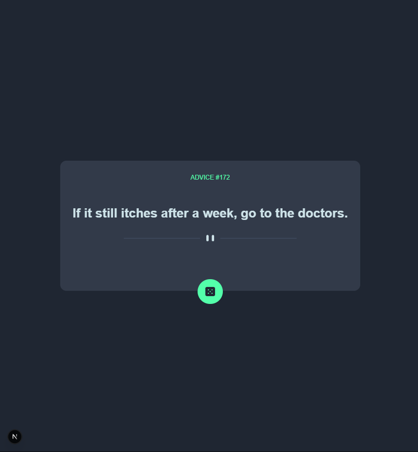

# Frontend Mentor - Advice Generator App Solution 🎲💡

Welcome to my take on the **Advice Generator App**! This is my solution to the [Frontend Mentor challenge](https://www.frontendmentor.io/challenges/advice-generator-app-QdUG-13db). If you ever find yourself in need of life-changing wisdom from the depths of the internet, you’re in the right place. 🤓

---

## 📖 Table of Contents

- [Overview](#overview)
  - [The Challenge](#the-challenge)
  - [Screenshot](#screenshot)
  - [Links](#links)
- [My Process](#my-process)
  - [Built With](#built-with)
  - [What I Learned](#what-i-learned)
  - [Continued Development](#continued-development)
  - [Useful Resources](#useful-resources)
- [Author](#author)
- [Acknowledgments](#acknowledgments)

---

## 🌍 Overview

### 💪 The Challenge

Your mission, should you choose to accept it (which I already did), was to build an app that:

- Displays advice fetched from an API 📜
- Looks awesome on any device 📱💻🖥️
- Reacts to hover states like a cat to a laser pointer 🐈🔴
- Generates fresh wisdom when you click the dice icon 🎲

### 📸 Screenshot



*(Imagine something beautiful until I update this with an actual screenshot!)*

### 🔗 Links

- **Solution URL:** [Click here!](https://github.com/MduduziNdlovu-dev/advice-generator)
- **Live Site:** [Check it out!](https://advice-generator-seven-gamma.vercel.app)

---

## 🔨 My Process

### 🏗️ Built With

- **HTML5** - Because we’re civilized.
- **CSS3** - Styled with custom properties and just enough Flexbox & Grid magic. ✨
- **React** - Because life is too short for vanilla JavaScript. ⚛️
- **Next.js** - Faster than my morning coffee. ☕⚡
- **Styled Components** - Because inline styles are a crime. 🚓

### 🧠 What I Learned

This project reminded me that:

- APIs can be both a blessing and a curse. One minute you’re getting golden nuggets of wisdom, the next you’re staring at a 404 error. 😅
- Styled Components are pretty neat, but CSS Grid still reigns supreme. 👑
- Always double-check your API response before trying to display it (otherwise, enjoy staring at `undefined` for hours). 🤦‍♂️

Here’s a cool snippet of my API-fetching magic:

```tsx
const fetchAdvice = async () => {
  try {
    const res = await fetch("https://api.adviceslip.com/advice");
    const data = await res.json();
    setAdvice(data.slip.advice);
  } catch (err) {
    console.error("Oops, no wisdom today!", err);
  }
};
```

### 🚀 Continued Development

Going forward, I’d love to:

- Maybe even turn this into an *Advice-a-Day* widget for my future projects!

### 📚 Useful Resources

- [MDN Flexbox Guide](https://developer.mozilla.org/en-US/docs/Web/CSS/CSS_Flexible_Box_Layout) - Because Flexbox is my ride-or-die.
- [Styled Components Docs](https://styled-components.com/docs) - Style without the hassle.
- [Frontend Mentor](https://www.frontendmentor.io/) - My coding gym. 💪

---

## 🤓 Author

- **Website:** [My Portfolio](https://www.your-site.com)
- **Frontend Mentor:** [@yourusername](https://www.frontendmentor.io/profile/yourusername)
- **Twitter/X:** [@yourusername](https://www.twitter.com/yourusername) *(I mostly tweet about code and coffee)*

---

## 🎩 Acknowledgments

Big shoutout to **coffee** ☕, **JavaScript** 🚀, and the **Frontend Mentor community** for keeping me motivated! Also, thanks to my WiFi for not disconnecting mid-deployment. 🙏

---

### ⭐ If you liked this project, hit me up with some feedback! 🚀

